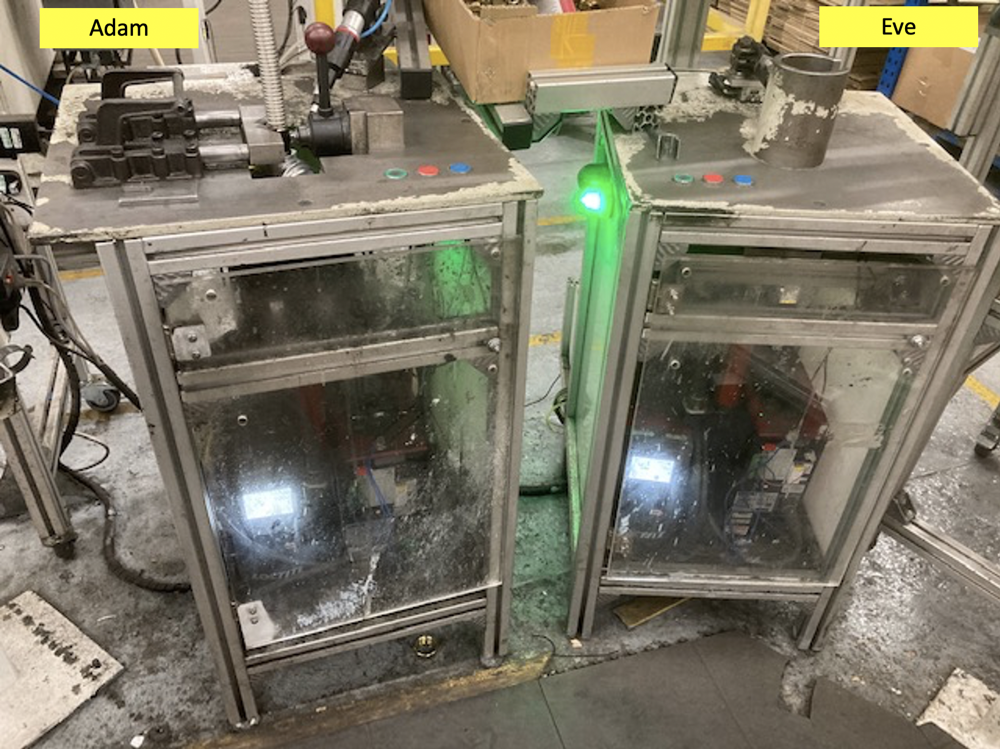
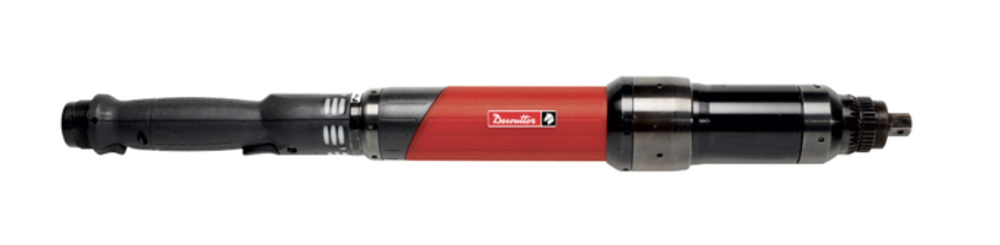

# Robotic Automation Machines
This ReadMe is an overview of work I completed that took place over a 10 week period in late 2017 to specify, design, program and build 8 x off robotic automation machines to eliminate a productivity constraint within a Gas regulator hose and brass insert assembly process that was a high cost, labour intensive, difficult to manage and difficult to ensure product quality. 

## Final Machines x 8 Off (2 of each type)
It is customary to start by showing completed photos of the artefact's to show how the design developed. The machines I specified, designed and built are called Adam & Eve, mainly because one takes a male insert and one receives a male insert. Also, they were the first 2 of 8 built so it felt natural to give them these names. The machines below may look a little scruffy but they have been producing 1 part every 22 seconds for the last 3 years. They significantly improved the productivity of the manufacturing cell while allowing a dataum for further improvements to be made. 

They are modular in design so can be quickly updated with minimal fuss and all parts have been specified with open source software and next day standard spec parts to reduce the cost and risk as much as possible. 8 of these machines (4 of each type) were built at a cost of £140k in total which is around £80k less then a single machine was quoted for from automation providers. 

## Project Outline
The project was born from the need to improve the manufacturing output of a home Gas Regulator which required a highly skilled but intensive style of manufacturing. Components were difficult to implement within a fully automated framework due to their texture, size, orientation and supplier packing. Additionally, fully automated, even semi-automated machinery was prohibitively expensive while still allowing UK manufacturing. 

Previous attempts to automate the full assembly had failed due to high costs across managing the automated machine, long periods of downtime due to part failure as well as not offering the flexibility required when changeovers or new orders were received. 

I was asked to provide a solution to enable the manufacturing cell to increase their production rate of 55 units per hour to 110 units per hour, without any increase in staffing levels as well as providing a manufacturing cell with flexibility to either have 3/4/5 or 6 team members to enable day to day flexing of cell output.

## Ideation

The initial starting point of the project was to analyze the current processes to identify opportunities for automation as well as line balancing and task consolidation. Part of my role within the business was to develop and deploy these tools to improve processes so I was familiar with the concepts. The assembly process from raw material to tested, assembled and packaged products was 5 key steps. The 4th step required the assembly of a brass insert into the regulator body and the assembly of the hose to the regulator body. This was 1 single labor intensive task that required heavy tooling and had high PPE requirements. This task also required the manual application of Loctite glue to threaded elements of the brass insert and the hose. Both components also had specific torque requirements; the hose for example required torqueing to 60 Nm. 

Of the whole a build process this task (task 4) was identified as the most possible to be automated, due to its repetitive nature as well as being a key bottleneck with respects to downtime and equipment failure. Additionally, it was seen that if this process could be at least halved in terms of process time, then it would serve as a platform for future productivity benefits as other parts of the process were pulled up as future line balancing tasks were completed. 

## Development

So at this stage, the task was clear. Develop an automated system that will complete the hose to body assembly as well as the brass insert to body assembly. My initial thought was to seek external help form automation manufacturers. However, upon receipt of specification their costs come back at circa £175k-250k per machine and a 4-6 month lead time. The cost was not supported by the savings and the lead time would not support the production program so the task was then to build solutions in house. I was given full use of the site maintenance team as well as a small tool room to achieve this task. I was given 8 weeks to complete all the design, development, build and implementation of these in house machines into the line, as well as ensure relevant CE criteria was achieved. To achieve this I was given no more than £140k for the complete project - which required a full CapEx approval (2 weeks fast track). 

## Design and Build

To achieve the rapid turn around of the project I decided to split the tasks into 2 separate items and automate the key functions. I would deeply a person to transition the work between the machines and manage the positioning of stock. Depending on requirements this aspect could be automated away using CoBots such as the UR3e from [Universal Robots](https://www.universal-robots.com/products/ur3-robot/). 

### Torque Unit

To enable the Brass and hose element to be assembled some manipulation of the part was required. This manipulation had to allow for a tight torque tolerance to be achieved but also had to be quick and record torque readings so that retrospective quality checks could be completed. This torque unit would be in constant use with circa 110 uses per hour. This would be across a 3 shift pattern meaning that a robust choice was needed as well as rapid of the shelve spares (UK based for same day delivery) if required. Additionally, this element of the build was going to be the most costly part so needed to be right. Desoutter Tools were chosen for this task with the [CVI3 Controller](https://www.desouttertools.com/tools/2/electric-assembly-systems/21/cvi3-range/210/cvi3-controllers) and [EID INline Electric Nutrunners](https://www.desouttertools.com/tools/2/electric-assembly-systems/21/cvi3-range/214/eid-inline-electric-nutrunners) chosen for the task. These tools however would need to be adapted for the task at hand and will be used in a non conventional way. 

#### CV13 Controller

The CV13 controller offered full control over the attached inline nut runner but crucially could be adapted to take a 24v input that would support an embedded system to control the unit to start, stop and provide an emergency stop facility.

To enable automated control of the torque unit an adaption kit is required so that the I.O pinout can be accessed. The controller itself allows each pin to be configured. To start and stop the unit. 

#### EID Electric Inline Torque Driver

Although these tolls are designed to be hand held the machine was it was decided to place these units vertically and fasten them into position using a mounting place. The torque guns each had a high density spring in the end which was removed so that any vertical float was eradicated. This allowed the base of the gun to act as a floor and when the device rotated the screwed element could float free and be pulled down with the counterforce off of the spring pushing it off the nut drive element. 

### Loctite Dispenser

A key element in the application of the Loctite glue was the quantity and the position the Loctite was required to be. This was historically a manual task that was managed via eyesight and experience alone. Additionally, Loctite was one of the most expensive consumable items within the assembly so even a small continual above specification application (i.e. costed Bill of Material or BOM) resulted in a financial impact for the product line. 

Pneumatic options for dispensing Loctite glue was not viable due to the temperature gradient experienced within the facility across winter and summer (effected the viscosity of the Loctite) the as well as the variance seen on the pneumatic system airlines (also due to cold/hot weather as the line ran across an outside area). Additionally compressed air was in use throughout the facility and depending on consumption the line pressure could be sporadic. 

With this in mind a [Loctite volumetric Compact Rotor Pump](https://equipment.loctite.com/product/Compact-Rotor-Pump-Dispenser-4.0) was selected. The rotor pump was electric and was able to apply precision quantities of Loctite without concern for viscosity issues or pneumatic variances. A key benefit was that the volume flow could be closely controlled so when coupled with the torque drive I could achieve either a 50% or 75% or any value I required circumferential coverage - I just needed to ensure that timings were correct. 

As 8 machines were required 8 x off of these nits were needed which alone cost circa £34k of the £140k budget. A controller unit for each dispenser was also still required to manage the application of which the [EQ RC15 Pump Controller](https://equipment.loctite.com/product/EQ-RC15-Pump-Controller) was chosen. This allowed for the precision output of the Loctite glue as well as managing the flow rates and pressure dispensing system that the Loctite sat in at the rear of the machine (constant pressure was required to ensure the electric rotor was full). 

 

### Embedded PLC

The torque unit and Loctite dispensers worked well independently but required a system to combine all of the activities together. This system needed to ensure that timings were accurate and that it could operate in a harsh environment. It needed to be robust and easy to program. It also needed to have open software that could be used on any machine as well as been quick to learn and understand by all people who may be in contact with the machine units (Maintenance or process engineers etc). 

With this in mind a RS branded [Pro Logic PLC](https://uk.rs-online.com/web/p/plcs-programmable-logic-controllers/9176370/) was chosen. This was readily available, cheap and had a next day lead time. It was also modular and very easy to program. 

This may seem a trivial choice but within the business this was one of the first automation machines. This meant that whatever was chosen here was something that would then be developed up in and replicated across the site. This meant that this choice needed to be right not just for toady but for 10-15 years in the future. Too often do manufacturing sites have to keep old Windows 7 versions operating just for a single piece of software critical. We needed to avoid this. 

The Pro Logic Module was programmed using ladder Logic with the [Design Spark software](http://auto.designspark.info/exe/RS_Logic_Module.zip) provided by RS. This enabled a very simple interface where rails are used with inputs on the left and outputs on the right with the actions in between acting as statements that control the system overall. This allows loops, iterations, feedback etc to be developed within the system. Importantly it also allows the system to be easily updated with new functions such as adding a Green/Red light to a switch by quickly adding it to this input. 

It took around 35 lines of code to control, the whole system with the main body of work deriving the correct timings between the devices to ensure correct application or rotational speed to Loctite application to Torque. As an example, if the rotation speed of the torque drive was too quick then the Loctite would not wick onto the threads and the part wold fail a seal test that followed immediately after this process. 

### Framework

The framework of the machines was chosen to be 40mmx40mm with 8mm groove [aluminum strut](https://www.universal-robots.com/products/ur3-robot/) by RS. This strut would allow for fast assembly, I could cut it on a band saw as well as easily chamfer the edges to remove burrs. It was also very readily available and come in 8m lengths for next day delivery. The business also had an account with RS which allowed me to proceed with a build without a full CapEx approval. Additionally, as the strut would make the frame of the machine I would use the 8mm groove to install Plexiglas and provide a substructure to the unit, such as shelving for the control and embedded system. 

### Jigs and Fixtures

Within the design a complex element was how the parts were to be held. This required special thinking around where the loads were applied and how the torque could be achieved without damaging the body of the products. 60Nm torque was required on the hose element alone and although that may not sound much it requires an average size male to lean heavily into a manual torque wrench to achieve this level of tightness - 60Nm is quite a force to have to apply. Any fixtures would need to with stand this time over time without deformation. This required a heavy top plate to be used as a surface for all the clamping to be attached too. This plate was 12mm thick steel which weighed around 30kg. The benefit of this top plate was that it could be machined and drill and tapped to provide a robust fixturing points as well as provide some needed weight to the aluminum frame to stop the impact force when running a torque gun at full speed to 60Nm then having an immediate stop. 

### Component Positioning

Positioning the component ready for torque application and fastening the component were two completely separate tasks. The hose which was being applied to the regulator body had a low concentric tolerance which meant that the general shape could not be relied upon to position exactly the same each time. This meant a guide had to be developed within the clamping system itself, then once near a position it could be secured. Additionally, the hose was susceptible to fracture if gripped too hard, also, if the hose slipped even a small amount there would be aesthetics damage which would render the product as scrap. 

With this in mind I chose the employ a V shaped clamp of my own design using [toggle clamps](https://uk.rs-online.com/web/p/clamps/0254692/) as a handle to engage the piece and then a V shaped positioner which I designed to hold a variant of the [MitteeBite edge clamp](https://www.wdscomponents.com/en-gb/jig-fixture/mitee-bite-work-holding/mitee-bite-edge-clamps/c-248). Once the piece was inline then it could be clamped using a [Axial Inline Clamp](https://www.wdscomponents.com/en-gb/jig-fixture/clamps/c-141). The axial inline clamp was chosen because it has a 90 degree locking position but crucially, locking doesn't occur until within a distance of 2mm. This final 2mm of travel is then actioned on a CAM system that can clamp to 500kg of load. The final positioning of this camp allowed for the clamp to still engage the part but not damage the part due to this close clamping distance. This duel setup allowed both the positiinng clamp and the axial clamp to come together to offer a positive locking position no matter what the concentricity of the hose was but still meant that the centre of the hose was directly above the torque drive so when rotated it did not move off centre. 

### Part Positioning

The final piece of the development was ensuring that all parts could come together when required. This meant specifying suitable solenoid valves as well as suitable linear pneumatic guide that would provide a dead stop once the limit was reached. These guides would be heavily used so a robust and simple system was needed. The environment within the facility meant that dirt and grime could enter the guide so simple removal and cleaning was required with a rag at the end of the shift at most. 

To this end SMC were chosen as providers of [solenoid valve with SMC connector lead](https://uk.rs-online.com/web/p/pneumatic-solenoid-pilot-operated-control-valves/3886835/) as SMC have a great reputation as well as next day delivery with many providers. When specifying a Solenoid it is required to know the G port connection to connect the diameter pneumatic tube into (I used 6mm low pressure tubing throughout the machine and connected with a 1/8th inch G port valve), the trigger voltage. 24V dc was used throughout the machine and also the port options such as 5/2 or 3/2. This just means that you can have 3 ports and 2 positions or 5 ports and 2 positions or have a spring return etc. My application required a 5/2 configuration. 

The guide way required further review as these needed to have a dead stop action so length was a critical element. The unit needed to ensure that it didn't hang off the end of the machine but also required enough travel to remove itself form the assembly area so that an operator could reach in and remove a product without clashing any components. This guide also required to have the Loctite glue dispenser positioned on top of it so that it could be directed directly to the thread of the hose and brass insert. The unit chosen was the [SMC Slide unit actuator](https://uk.rs-online.com/web/p/slide-unit-actuators/7007421/) which provided suitable drill patterns so that it could be attached directly to the table top as well as have attachments upon the top of the unit. It come in a range of strokes and was easy to adjust. It also had an dead stop upon reaching its stroke limit. 

### Final Machine Build

The final machine build required around 2 weeks with 1 person. There were 2 separate machines that worked in a pair with a total of 8 machines overall. These were implemented into 4 x manufacturing cells. The overall project started off as a long shot on a process that had seen many improvements few step changes. As the business started to look at technology around automation and how it could be combined within the process it started to realize the potential of combining human ideas with automated processes to free up people to do the interesting work. 

I learned several important lessons during the development and build of these machines but non more so than to keep a system as simple as possible. there were many suggestions of how to improve the operation of these machines but each one required a level of complexity that would have needed significant extra support or increased downtime if a problem was to arise. Also, the benefit of modularization when thinking through developing automation equipment like this. Allowing these machines to be be taken apart section by section and have elements quickly replaced allowed others to engage in the processes they needed to only learn the machines bit by bit. 

Finally, having a broad set of skills and awareness also helped me navigate pitfalls around introducing complicated features. Having an understanding of what it takes to fabricate a part via milling, lathe turning or grinding as well as general part assembly meant that suitable materials were chosen at the outset meaning that the machines had a longer life span than planned. I am glad to say all 8 x machines are in operation today more than 3 years after they were built.

